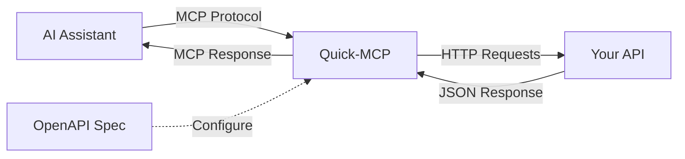

# Quick-MCP

**Dynamic proxy server that converts OpenAPI specifications into Model Context
Protocol (MCP) tools and resources in real-time.**

Quick-MCP bridges the gap between existing REST APIs and AI assistants by
automatically generating MCP-compatible interfaces from OpenAPI specifications.
This enables AI agents to interact with any API that has an OpenAPI spec without
requiring custom integration code.

## 📦 Packages

This is a TypeScript monorepo containing:

- **[@quick-mcp/core](./packages/core/)** - Main library and CLI
- **[@quick-mcp/test](./packages/test/)** - LLM-powered testing framework
- **[@quick-mcp/demo](./packages/demo/)** - Example API server for testing

## ✨ Key Features

- **Dynamic Proxy Architecture**: Real-time OpenAPI → MCP conversion
- **Smart Resource Classification**: GET operations → resources, others → tools
- **Parameter Mapping**: Automatic MCP ↔ REST API conversion
- **Dual Transport Support**: HTTP and STDIO transports
- **Authentication Forwarding**: Secure header-based auth
- **Production Ready**: Comprehensive error handling and testing (63% coverage)
- **Developer Experience**: Rich CLI, environment config, detailed logging

## 🎯 Use Cases

**For AI Assistant Developers:**
- Connect to any OpenAPI-documented API instantly
- No custom MCP server development required
- Automatic parameter validation and error handling

**For API Providers:**
- Make existing APIs AI-accessible without code changes
- Leverage current OpenAPI documentation
- Maintain security through authentication forwarding

**For Platform Builders:**
- Bootstrap MCP ecosystems from existing API catalogs
- Scale AI integration across multiple APIs
- Support development through production deployment

## 🚀 Quick Start

### For Users

Install and use the CLI:

```bash
npm install -g @quick-mcp/core
quick-mcp --spec https://api.example.com/openapi.json
```

**👉 [See full usage docs](./packages/core/README.md)**

### For Developers

Clone and explore the demo:

```bash
# Clone and install
git clone https://github.com/wycats/quick-mcp.git
cd quick-mcp
pnpm install

# Terminal 1: Start demo API server
pnpm dev:demo

# Terminal 2: Start Quick-MCP proxy
pnpm dev --spec http://localhost:3001/api-docs.json
```

The demo converts a sample OpenAPI spec into MCP tools that can be used by
Claude or other MCP clients.

## 🏗️ Development

### Prerequisites

- Node.js 18+
- pnpm
- An OpenAPI specification for testing

### Setup

```bash
# Install dependencies
pnpm install

# Run tests
pnpm test

# Build packages
pnpm build

# Start demo environment
pnpm dev:demo
```

### Project Structure

```
quick-mcp/
├── packages/
│   ├── core/           # Main library and CLI
│   ├── test/           # LLM testing framework
│   └── demo/           # Example API server
├── tests/              # Integration tests
├── docs/               # Additional documentation
└── README.md          # This file
```

## 🔄 How It Works

Quick-MCP creates a live proxy between OpenAPI APIs and MCP clients:



### Conversion Process

1. **Load OpenAPI Spec**: Parse and validate OpenAPI 2.0/3.0 specifications
2. **Classify Operations**:
   - GET operations → MCP Resources (for data retrieval)
   - POST/PUT/DELETE → MCP Tools (for actions)
3. **Generate MCP Interface**: Create tools/resources with proper schemas
4. **Handle Requests**: Convert MCP calls to REST API requests
5. **Return Responses**: Transform API responses back to MCP format

## 🤝 Contributing

We welcome contributions! Please see:

- [CONTRIBUTING.md](CONTRIBUTING.md) - Contribution guidelines
- [DEVELOPMENT_PRACTICES.md](DEVELOPMENT_PRACTICES.md) - Development workflows
- [ARCHITECTURE.md](ARCHITECTURE.md) - System architecture

### Development Commands

```bash
# Install dependencies
pnpm install

# Run tests
pnpm test
pnpm test:coverage

# Build packages
pnpm build

# Code quality
pnpm lint
pnpm lint:fix

# Start demo environment
pnpm dev:demo
```

## 📚 Documentation

- **[API Reference](API.md)** - Complete API documentation
- **[Architecture Guide](ARCHITECTURE.md)** - System design and patterns
- **[Development Practices](DEVELOPMENT_PRACTICES.md)** - Coding standards and workflows
- **[Package Documentation](packages/core/README.md)** - Core package usage

## 🚀 Deployment

### Docker

```dockerfile
FROM node:18-alpine
RUN npm install -g @quick-mcp/core
EXPOSE 8080
CMD ["quick-mcp", "--spec", "/app/openapi.json", "--env"]
```

### Heroku

```bash
heroku config:set OPENAPI_SPEC_URL="https://your-api.com/openapi.json"
heroku config:set PORT="8080"
git push heroku main
```

## 📊 Project Status

- **Test Coverage**: 63% (Core package)
- **TypeScript**: Strict mode enabled
- **Production Ready**: Error handling, timeouts, logging
- **Actively Maintained**: Regular updates and improvements

## 🔗 Links

- [Issues](https://github.com/wycats/quick-mcp/issues) - Bug reports and feature requests
- [Discussions](https://github.com/wycats/quick-mcp/discussions) - Community discussions
- [Releases](https://github.com/wycats/quick-mcp/releases) - Release notes and downloads

## 📄 License

MIT - see [LICENSE](LICENSE) file for details.
  --base-url http://localhost:3000
```

### Secured API Integration

```bash
# Make authenticated APIs accessible to AI workflows
quick-mcp --spec https://api.example.com/openapi.json --headers auth.json
```

## Roadmap

### ✅ Foundation (Completed)

- [x] Core OpenAPI to MCP conversion
- [x] HTTP and STDIO transport support
- [x] Authentication forwarding
- [x] Production error handling and timeouts
- [x] Comprehensive testing (58% coverage)

### 🚧 Enhanced Features (In Progress)

- [ ] Enhanced error hierarchy and monitoring hooks
- [ ] Performance optimizations and caching
- [ ] OpenAPI security scheme support
- [ ] Request/response schema validation

### 🔮 Ecosystem Growth (Planned)

- [ ] Plugin system for custom MCP extensions
- [ ] Developer tools and debugging UI
- [ ] Container deployment patterns
- [ ] Community integrations and examples

## Contributing

This project follows a two-phase development process:

1. **Exploration**: Rapid prototyping with AI assistance
2. **Consolidation**: Manual refinement to production quality

See [DEVELOPMENT_PRACTICES.md](DEVELOPMENT_PRACTICES.md) for detailed
guidelines.

## License

MIT License - see [LICENSE](LICENSE) file for details.

---

**Note**: Quick-MCP is production-ready for basic use cases but continues
evolving to support advanced platform integration. Contributions welcome for all
aspects of the roadmap.
