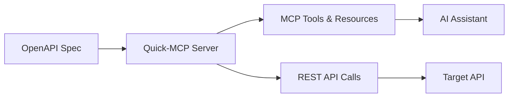

# Quick-MCP

**Dynamic proxy server that converts OpenAPI specifications into Model Context
Protocol (MCP) tools and resources in real-time.**

Quick-MCP bridges the gap between existing REST APIs and AI assistants by
automatically generating MCP-compatible interfaces from OpenAPI specifications.
This enables AI agents to interact with any API that has an OpenAPI spec without
requiring custom integration code.

## Core Features

- ✅ **Dynamic Proxy Architecture**: Real-time OpenAPI → MCP conversion without
  code generation
- ✅ **Smart Resource Classification**: GET operations become resources, others
  become tools
- ✅ **Parameter Mapping**: Automatic conversion between MCP arguments and REST
  API parameters
- ✅ **HTTP Transport**: Full support for MCP over HTTP with configurable
  timeouts
- ✅ **STDIO Transport**: Command-line integration for desktop AI assistants
- ✅ **Authentication Forwarding**: Header-based auth support for secured APIs
- ✅ **Production Hardening**: Error boundaries, timeouts, and comprehensive
  testing (58% coverage)

## Key Benefits

**For AI Assistant Developers:**

- Instantly connect to any API with OpenAPI documentation
- No custom MCP server development required
- Automatic parameter validation and error handling

**For API Providers:**

- Make your API AI-accessible without code changes
- Leverage existing OpenAPI specifications
- Maintain security through authentication forwarding

**For Platform Builders:**

- Bootstrap MCP ecosystems from existing API catalogs
- Enable AI integration at any scale
- Support development workflows through production deployment

## Quick Start

### Prerequisites

- Node.js 18+
- pnpm

### Try the Demo

```bash
# Clone and install
git clone <repository-url>
cd quick-mcp
pnpm install

# Terminal 1: Start demo API server
pnpm dev:demo

# Terminal 2: Start Quick-MCP proxy (after demo is running)
pnpm dev --spec http://localhost:3001/api-docs.json --port 8080 --transport http
```

The demo converts a sample OpenAPI spec into MCP tools that can be used by
Claude or other MCP clients.

### Use with Your API

```bash
# Start Quick-MCP pointing to your OpenAPI spec
pnpm dev --spec https://your-api.com/openapi.json --port 8080 --transport http
```

## How It Works

Quick-MCP acts as a dynamic proxy that converts OpenAPI specifications into
MCP-compatible interfaces:



### Conversion Process

1. **Specification Loading**: Validates and parses OpenAPI 3.0 specifications
2. **Operation Classification**:
   - GET operations with path-only parameters → MCP Resources
   - All other operations → MCP Tools
3. **Parameter Mapping**: Converts between MCP JSON arguments and REST API
   parameters
4. **Request Proxying**: Forwards tool calls as authenticated HTTP requests
5. **Response Formatting**: Transforms API responses for MCP clients

### Architecture

- **Dynamic Proxy Pattern**: No static code generation - live conversion at
  runtime
- **Operation-Centric Design**: Each OpenAPI operation becomes an MCP tool or
  resource
- **Transport Agnostic**: Supports both HTTP and STDIO MCP connections
- **Production Ready**: Built for reliability with error handling and monitoring
  hooks

## Development

See [DEVELOPMENT_PRACTICES.md](DEVELOPMENT_PRACTICES.md) for development
workflows and AI-assisted coding practices.

```bash
# Install dependencies
pnpm install

# Run tests
pnpm test

# Build
pnpm build

# Lint
pnpm lint
```

## Use Cases

### AI-Powered API Testing

```bash
# Convert any API to MCP for AI-assisted testing
quick-mcp --spec https://api.github.com/openapi.json \
  --auth-header "Authorization: token $GITHUB_TOKEN"
```

### Development Workflow Integration

```bash
# Enable AI assistants to interact with your development APIs
quick-mcp --spec http://localhost:3000/api-docs.json \
  --base-url http://localhost:3000
```

### Secured API Integration

```bash
# Make authenticated APIs accessible to AI workflows
quick-mcp --spec https://api.example.com/openapi.json --headers auth.json
```

## Roadmap

### ✅ Foundation (Completed)

- [x] Core OpenAPI to MCP conversion
- [x] HTTP and STDIO transport support
- [x] Authentication forwarding
- [x] Production error handling and timeouts
- [x] Comprehensive testing (58% coverage)

### 🚧 Enhanced Features (In Progress)

- [ ] Enhanced error hierarchy and monitoring hooks
- [ ] Performance optimizations and caching
- [ ] OpenAPI security scheme support
- [ ] Request/response schema validation

### 🔮 Ecosystem Growth (Planned)

- [ ] Plugin system for custom MCP extensions
- [ ] Developer tools and debugging UI
- [ ] Container deployment patterns
- [ ] Community integrations and examples

## Contributing

This project follows a two-phase development process:

1. **Exploration**: Rapid prototyping with AI assistance
2. **Consolidation**: Manual refinement to production quality

See [DEVELOPMENT_PRACTICES.md](DEVELOPMENT_PRACTICES.md) for detailed
guidelines.

## License

MIT License - see [LICENSE](LICENSE) file for details.

---

**Note**: Quick-MCP is production-ready for basic use cases but continues
evolving to support advanced platform integration. Contributions welcome for all
aspects of the roadmap.
