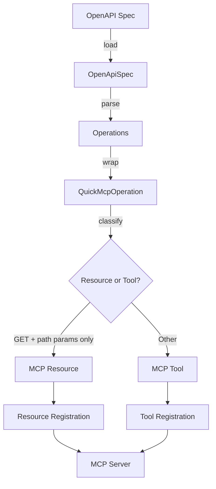
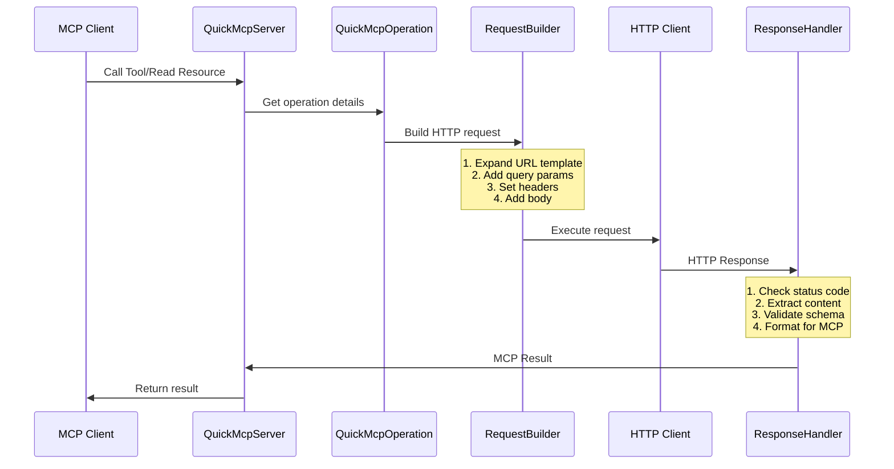

# Quick-MCP Abstraction Flow Diagram

## 🔄 High-Level Data Flow



## 🏗️ Request Processing Pipeline



## 🧩 Key Abstraction Layers

> **Note**: Quick-MCP uses simple type aliases and validation functions instead of complex domain objects. This keeps the codebase lean while maintaining type safety.

### **1. Type Layer**

```text
┌─────────────┬──────────────┬───────────────┐
│    Port     │   Headers    │   SpecUrl     │
├─────────────┼──────────────┼───────────────┤
│ Type alias  │ Native Web   │ Type alias    │
│ number      │ Headers API  │ string        │
│ Validation  │ Built-in     │ URL validation│
└─────────────┴──────────────┴───────────────┘
```

**Validation Functions** (`types.ts`):

- `validatePort(port: number | string): Port` - Ensures 1-65535
- `validateSpecUrl(url: string): SpecUrl` - Validates URL format
- `getDefaultPort(): Port` - Returns environment-based default

**Header Utilities** (`utils/headers.ts`):

- `parseHeaderString(str: string): Headers` - Parse "Key=Value"
- `parseHeadersFromJSON(json: string): Headers` - Parse JSON headers

### **2. Configuration Layer**

```text
ServerOptions
     │
     ├── spec: string      // validated URL
     ├── port: number      // validated 1-65535
     ├── headers: Headers  // native Headers
     └── transport: 'http' | 'stdio'
     
ConfigurationBuilder
     │
     ├── withSpec(spec)
     ├── withPort(port)
     ├── withHeaders(headers)
     └── build() → ServerOptions
```

### **3. Operation Layer**

```text
OpenAPI Operation
     │
     ├── HTTP Method (GET, POST, etc.)
     ├── Path (/users/{id})
     ├── Parameters
     ├── Request Body Schema
     └── Response Schemas
     
QuickMcpOperation
     │
     ├── verb: HttpVerb
     ├── inner: Operation
     ├── extensions: CustomExtensions
     └── Methods:
         ├── isResource()
         ├── asTool()
         └── asResource()
```

### **4. Schema Transformation**

```text
OpenAPI Schema          JSONSchema              Zod Schema
┌──────────────┐       ┌──────────────┐       ┌──────────────┐
│ type: string │  ───> │ type: string │  ───> │ z.string()   │
│ format: email│       │ format: email│       │   .email()   │
└──────────────┘       └──────────────┘       └──────────────┘
```

## 🔍 Error Handling Flow

```text
┌─────────────────────────────────────────────┐
│             Error Hierarchy                  │
├─────────────────────────────────────────────┤
│                                             │
│  BaseError                                  │
│      ├── ConfigurationError                 │
│      │   ├── Invalid port (1-65535)         │
│      │   ├── Invalid URL format             │
│      │   └── Missing env vars               │
│      │                                      │
│      ├── OpenApiError                       │
│      │   ├── Parse failure                  │
│      │   ├── Invalid spec                   │
│      │   └── Missing operations             │
│      │                                      │
│      ├── TransportError                     │
│      │   ├── Connection failed              │
│      │   ├── Timeout                        │
│      │   └── Network error                  │
│      │                                      │
│      └── ServerError                        │
│          ├── Startup failed                 │
│          └── Runtime error                  │
└─────────────────────────────────────────────┘
```

## 📊 Type Safety Boundaries

```text
External World          Type Boundary          Internal World
─────────────          ─────────────          ──────────────
                           
Raw strings      ───>  Validation Fns   ───>  Validated Types
(user input)           (validatePort)         (never invalid)

JSON responses   ───>  Zod Validation   ───>  Typed Objects
(HTTP/API)             (parse or throw)       (guaranteed shape)

Any OpenAPI      ───>  Type Guards      ───>  Known Types
(unknown shape)        (isValidApiObject)     (safe access)
```

## 🎓 Learning Tips

1. **Follow the Types**: TypeScript types document the flow
2. **Read the Tests**: Tests show real usage patterns
3. **Set Breakpoints**: Debug through actual execution
4. **Start Small**: Pick one abstraction and master it

## 🔗 Connection Points

- **Entry**: `main.ts` → CLI arguments → `ServerOptions`
- **Core**: `OpenApiSpec` → Operations → MCP Tools/Resources
- **Execution**: `OperationClient` → HTTP Request → Response
- **Output**: Response → Validation → MCP Format
